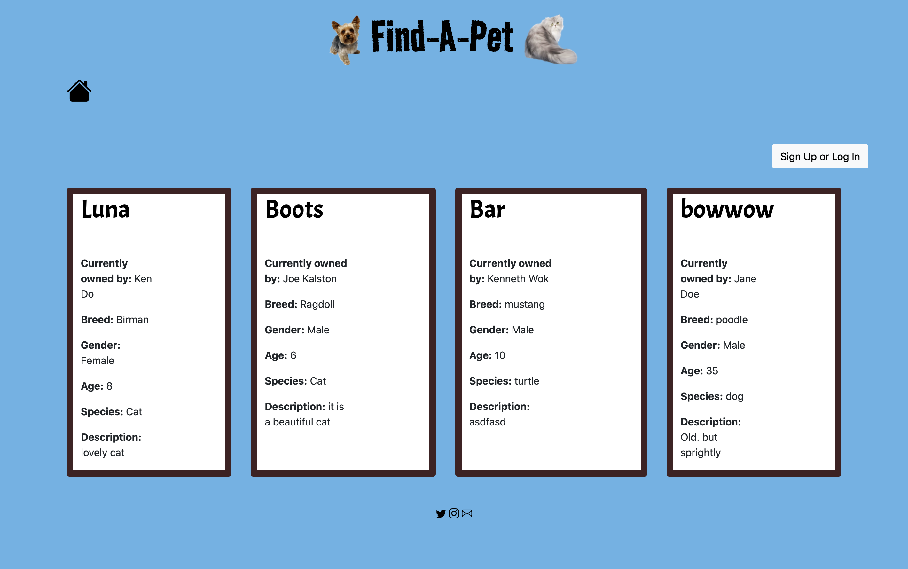
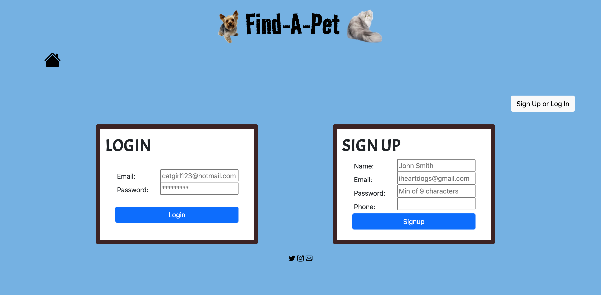
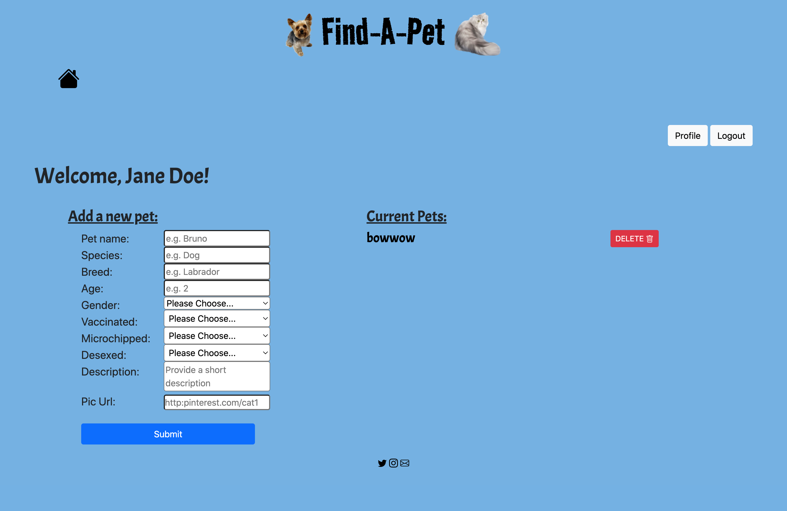

# Find-A-Pet

- <a href="#description">Project Description</a>
- <a href="#technologies">Technologies</a>
- <a href = "#installation-instructions"> Installation </a>
- <a href = "#future-development"> Future Development </a>
- <a href="#demonstration">Demonstration </a>
- <a href="#link">Link </a>
- <a href="#contact">Contact</a>

## Description

Find-A-Pet is an interactive noticeboard where users can view pets that are available for adoption. While any user can view a gallery of available pets, only registered and logged-in users can add a new pet, remove one they posted before and see all the details 

## Technologies

The project was created using:
* Javascript
* Node.js
* Express.js
* Handlebars
* SQL
* Bootstrap CSS Framework
* CSS
* Helmet

## Installation Instructions

To run successfully, the app requires the installation of Sequelize, dotenv, Express, Helmet and Handlebars.

The app requires a .env file to run (not included in the repository)

## Future Development 
* User should be able to submit images of a pet
* Styling
* Implement a search function to order the results

## Demonstration

The deployed project appears as below:

 

## Link
To see the working application click on the [heroku link](https://stormy-anchorage-52853.herokuapp.com/) or clone the [Github link](https://github.com/ekubik/find-a-pet.git)

## Contact
Contributors can be contacted through their github pages
* <a href="https://github.com/Nico749">Nico Pasqualini</a>
* <a href="https://github.com/ekubik">Ewa Kubik</a>
* <a href="https://github.com/Eugene32">Reynan Kanindot</a>
* <a href="https://github.com/emhat1">Erin Hatherell</a>
