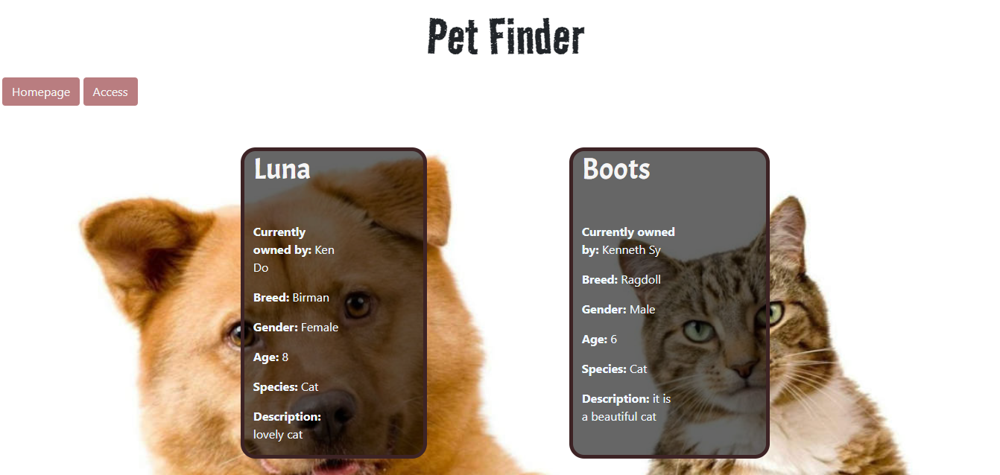
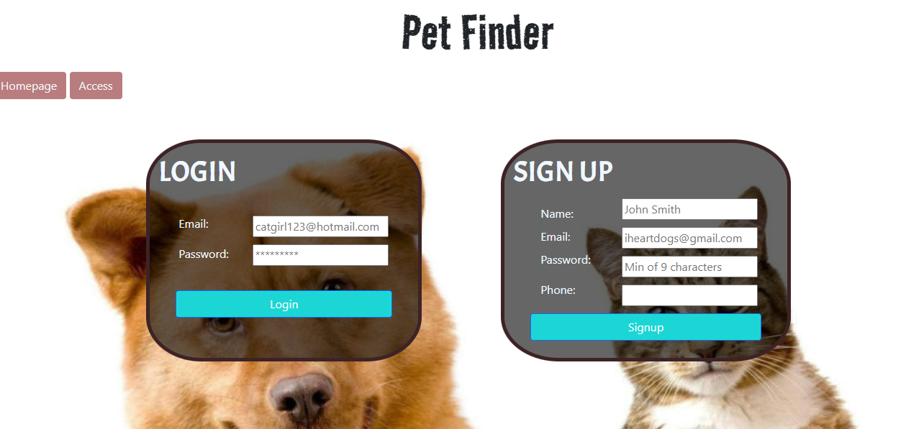
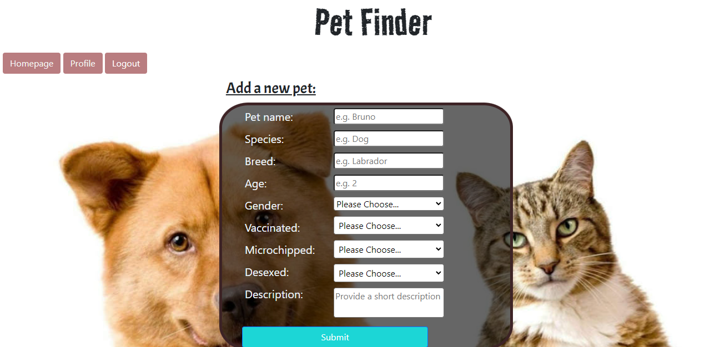

# Pet Finder

- <a href="#description">Project Description</a>
- <a href="#technologies">Technologies</a>
- <a href = "#installation-instructions"> Installation </a>
- <a href = "#future-development"> Future Development </a>
- <a href="#demo">Demo </a>
- <a href="#link">Link </a>
- <a href="#contact">Contact</a>

## Description

Pet Finder is a noticeboard where users can view pets that are available for adoption. While any user can view a gallery of available pets, only registered and logged-in users can add a new pet, remove one they posted before and see all the details 

## Technologies

The project was created using:
* JS
* Node.js
* Express.js
* Handlebars
* Sequelize
* Bootstrap CSS Framework

## Installation Instructions

To run successfully, the app requires the installation of Sequelize, dotenv, Express, and Handlebars.

The app requires a .env file to run (not included in the repository)

## Future Development 
* User should be able to upload images of a pet
* Implement a search function to order the results
* Minor styling changes required

## Demo

The following images show the application's homepage, login page and add a new pet page:

## Link
To see the working application click on the [heroku link](https://p-e-t-finder.herokuapp.com/) or clone the [Github link](https://github.com/Nico749/Pet_Finder.git)

## Contact

Created by: 
* [Nico Pasqualini](https://github.com/Nico749)
* Ewa Kubik
* Reynan Kanindot
* Erin Hatherell
